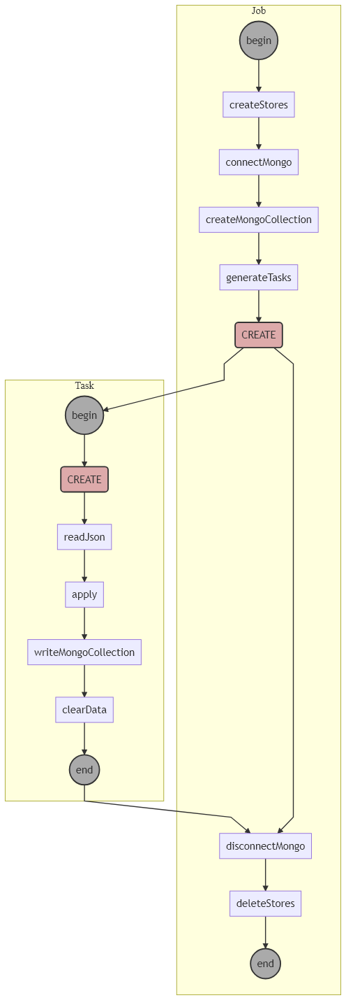

# k-openaq

A [Krawler](https://kalisio.github.io/krawler/) based service to download data from [OpenAQ](https://openaq.org)

## Description

The **k-openaq** allows to download **OpenAQ** data for a given list of countries.
The available countries is available [here](https://openaq.org/#/countries?_k=804jo5). Also, a Json output can be retrieved using the the following [query](https://api.openaq.org/v1/countries)

The available variables are:
* `pm25`: particulate matter PM255
* `pm10`: Particulate matter PM10
* `so2`: Sulphur dioxide  
* `no2`: Nitrogen dioxide 
* `o3`: Ozone
* `co`: Carbon monoxide 
* `bc`: Black carbon

The job relies on the [OpenAQ API](https://docs.openaq.org/#api-_).

The following diagram illustrates how the job works:

## Configuration

The job can be configured using the `config.json` file. It exposes the following parameters:

| Parameter | Description |
|---|---|
| `countries` | an array to specify the countries to take into account. By default: [ `FR` ] |
| `variables` | an array to specify the variables to scrape. By default: `[ 'pm25', 'pm10', 'so2', 'no2', 'o3', 'co', 'bc' ]` |
| `frequency` | allows to specify the `date_from` parameter. The date is equal to now() minus the frequency in seconds. By default: `3600` |
| `limit` | the limit of returned results. By default: `1000` |

## Deployment

We personally use [Kargo](https://kalisio.github.io/kargo/) to deploy the service.

## Contributing

Please refer to [contribution section](./CONTRIBUTING.md) for more details.

## Authors

This project is sponsored by 

## License

This project is licensed under the MIT License - see the [license file](./LICENSE) for details

